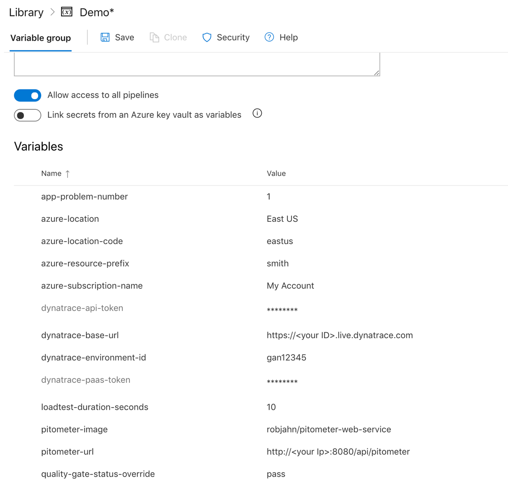
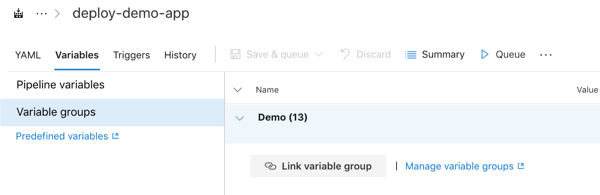

# Overview

This demo application was created to showcase the concept of [adding automated performance quality gates using Keptn Pitometer](https://cloudblogs.microsoft.com/opensource/2019/04/25/adding-automated-performance-quality-gates-using-keptn-pitometer/)

Once provisioned, the sample nodejs application will look like this for both a "staging" and "production" webapp intances.


# Folders and files

1. ```root folder and img/``` - location of demo ```app.js``` nodejs demo application
1. ```perfspec/``` - folder containing sample perfspec file
1. ```pipeline/``` - folder containing scripts that can be used in DevOps pipelines
1. ```arm/``` - folder containing scripts and templates to provision demo Azure resources

# Provision Azure resources

See [these instructions](./arm/README.md) 

# Azure DevOps pipelines

1. ```azure-pipelines.yml``` - this pipeline will build a zip artifact that is used to deploy to a staging and production web app. A dyntrace deployment event is done for both. A call to a pitometer web service acts as a quality gate to production
1. ```azure-pipelines-create-resources.yml``` - this pipeline is be run one-time as to setup the envionment. This will just call arm/provision.sh
1. ```azure-pipelines-delete-resources.yml``` - this pipeline is be run one-time as to delete the envionment. This will just call arm/remove.sh

Required Pipeline variables
* ```app-problem-number``` = value from 1 to 4
* ```azure-location``` = value such as 'East US'
* ```azure-location-code``` = value such as 'eastus'
* ```azure-resource-prefix``` = use your last name such as 'smith'
* ```azure-subscription-name``` = use name of your Azure subscription such as 'My account'
* ```dynatrace-api-token``` = generated value from your environment
* ```dynatrace-base-url``` = value such as 'https://<your ID>.live.dynatrace.com'
* ```dynatrace-environment-id``` = value such as gan12345
* ```dynatrace-paas-token``` = generated value from your environment
* ```loadtest-duration-seconds``` = number value such as 300 (5 minutes)
* ```pitometer-image``` = docker image. Use pre-build image of 'robjahn/pitometer-web-service'
* ```pitometer-url``` = url to your azure container app such as 'http://<your Ip>:8080/api/pitometer'
* ```quality-gate-status-override``` = value of 'pass' or 'fail'

Recommend creating a 'Variable Group'



then linking the variable group to each pipeline




# Local development

1. You must have [node](https://nodejs.org/en/download/) installed locally.
1. Once you clone the repo, you need to run ```npm install``` to download the required modules
1. run ```npm update```
1. run ```npm start```
1. access the application @ ```http://127.0.0.1:8080/```

