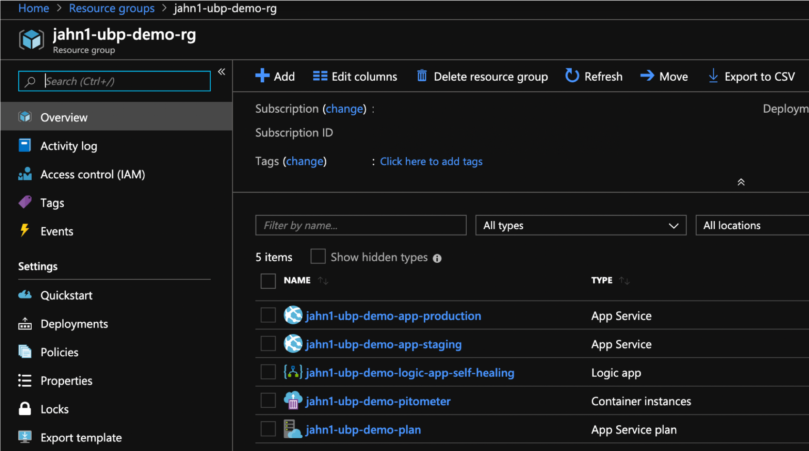

# Overview

This folder has scripts and azure resource temlates for provisioning a demo envionment.

Files:
* ```provision.sh``` = will create an Azure resource group, web apps, logic app, and container all
* ```remove.sh``` = will remove the Azure resource group this removing all created resources
* ```logicapp-template.json``` = arm template for the Azure logic app
* ```webapp-template.json``` = arm template for the Azure web app
* ```images/``` = files for this README

When this is done you will have these resources within your defined resource group.



# Pitometer container app

Web service will be reachable @ ```http://<IP Address:8080/api/pitometer```


# Demo Web apps

Demo app will be reachable @ listed URL.


# Logic app

Logic app will be reachable the access endpoint found in the properties.


# Pitometer service Testing

A tool like [postman](https://www.getpostman.com/) can be used to make the POST request to test our your PerfSpec file.


# How to provision locally without DevOps pipeline

There are two scripts to provision and remove the azure resources.  Both required you to first define the inputs.

1. Provision resources - creates a resource group and resources
    ```
    # user input values
    export AZURE_RESOURCE_PREFIX="<name that will prefix all resources names. example your last name>
    export AZURE_LOCATION="<value like 'East US'>"
    export AZURE_LOCATION_CODE="<value like 'eastus'>"
    export PITOMETER_IMAGE="<if you did not build your own, use robjahn/pitometer-web-service>"
    export AZURE_SUBSCRIPTION_NAME="<azure subscription name>"
    export DYNATRACE_ENVIONMENT_ID="<ID value like gan12345>"
    export DYNATRACE_PAAS_TOKEN="<PaaS Token value>"
    export DYNATRACE_API_TOKEN="<API Token value>"
    export DYNATRACE_BASE_URL="<example https://gan12345.live.dynatrace.com"
    export BUILD_SOURCE_DIR="<location of arm template files.  Just use the value '.' if running locally>"

    # Provision resources
    ./provision.sh /
        "$AZURE_RESOURCE_PREFIX" /
        "$AZURE_LOCATION" /
        "$AZURE_LOCATION_CODE" /
        "$PITOMETER_IMAGE" /
        "$AZURE_SUBSCRIPTION_NAME" /
        "$DYNATRACE_ENVIONMENT_ID" /
        "$DYNATRACE_PAAS_TOKEN" /
        "$DYNATRACE_API_TOKEN" /
        "$DYNATRACE_BASE_URL" /
        "$BUILD_SOURCE_DIR"
    ```

1. Remove resources -- this just deletes the azure resource group that contains all that your provisioned.
    ```
    export AZURE_RESOURCE_PREFIX="<same value you used for provision.sh>"
    ./remove.sh $AZURE_RESOURCE_PREFIX
    ```
